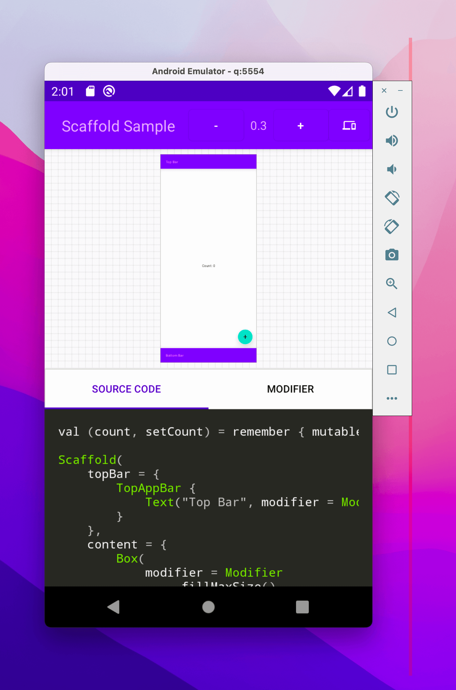
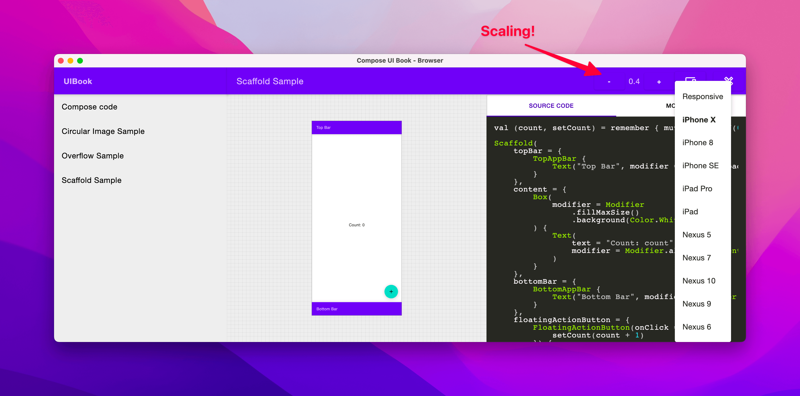

# Compose UI Book

Simple and extensible UI component explorer for Jetpack Compose and Android View

<p float="middle">
	
    
</p>

<details>
	<summary>You can check the demo video here</summary>
	<a href="https://www.youtube.com/watch?v=aB2cBjLuYHA">
		
	</a>
</details>

## Getting Started

Usually the UI component explorer is separated from the main app despite you have Android only or KMP project.
So the first thing you should do is to create a module with this `build.gradle.kts` (or `build.gradle` if you're using
Groovy)

### Setup Module - KMP

```kotlin
plugins {
    id("com.android.application")
    id("org.jetbrains.kotlin.multiplatform")
    id("org.jetbrains.compose")
    id("com.google.devtools.ksp")
}

// This could be in settings.gradle or root build.gradle
repositories {
    mavenCentral()
}

kotlin {
    jvm("desktop")
    android()

    sourceSets {
        named("commonMain") {
            dependencies {
                implementation("io.github.esafirm.uibook:browser-app:x.y.z")
            }
        }
        named("androidMain") {
            dependencies {
                // This is optional. If you use app compat then include this
                implementation("androidx.appcompat:appcompat:1.3.1")
                implementation("com.google.android.material:material:1.4.0")
            }
        }
        named("desktopMain") {
            dependencies {
                // This is mandatory as we current OS is not packaged in POM file
                implementation(compose.desktop.currentOs)
            }
        }
    }
}

android {
    // Insert Android related configuration in here
}

compose.desktop {
    // Insert compose desktop related configuration in here
}

dependencies {
    val processorDep = "io.github.esafirm.uibook:annotations-processor:x.y.z"
    add("kspAndroid", processorDep)
    add("kspDesktop", processorDep)
}
```

> :heavy_exclamation_mark: **Info**: Please check the [minimum KMP example](/examples/minimum-kmp) for more complete
> setup.

### Setup Module - Android Only

```kotlin
plugins {
    id("com.android.application")
    id("org.jetbrains.compose")
    id("com.google.devtools.ksp")
    kotlin("android")
}

android {
    // Insert Android related configuration in here
}

dependencies {
    implementation("io.github.esafirm.uibook:browser-app:x.y.z")
    implementation("androidx.appcompat:appcompat:1.3.1")
    implementation("com.google.android.material:material:1.4.0")

    ksp("io.github.esafirm.uibook:annotations-processor:x:y:z")
}

```

> :heavy_exclamation_mark: **Info**: Please check the [minimum android example](/examples/minimum-android) for more
> complete setup.

change `x.y.z` to version in the [release page](https://github.com/esafirm/android-ui-book/releases)

### Create First Book

To create book simple create an extension function that extend `BookHost` and give the function `@UIBook`
annotation.
In this case I will create a Kotlin file with name `Catalogue.kt` and then create this function:

```kotlin
@UIBook(name = "Compose Button")
@Composable
fun BookHost.SimpleCouter() {
    val (count, setCount) = remember { mutableStateOf(0) }
    Button(onClick = { setCount(count + 1) }) {
        Text(text = "Counter $count")
    }
}
```

That's it now run the new module that you just created.

### Android View Support

For Android target, it supports the Android `View`, just add the return type to the function

```kotlin
@UIBook(name = "Android TextView")
fun BookHost.SimpleTextView(): TextView {
    /**
     * This will draw text
     */
    return TextView(context).apply {
        text = "Hello World"
    }
}
```

## Advanced

For now, you can check the [sample module](/sample) for complete features.

## Development

To develop the project, you need to use Android Studio Dolphin above.

It have some strange issue with IntelliJ Idea 2022.3 EAP.

### Running Sample

To run the Android sample run this command:

```bash
./gradlew :sample:installDebug
```

To run the Desktop sample run this command:

```bash
./gradlew :sample:run
```

## Support

<a href='https://ko-fi.com/M4M41RRE0' target='_blank'></a>

## License

Esa @ MIT
